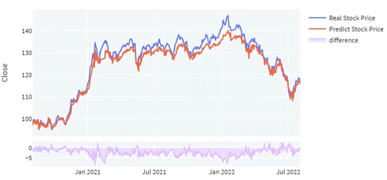

# 深度學習股價預測—LSTM模型
## 專題摘要
本研究以元大台灣50為例，使用2012到2022年共10年每日的股票開盤價、最高價、最低價、收盤價為依據，以長短期記憶LSTM模型預測股價的走向與價格。
我們將60%的資料作為訓練集；20%作為驗證集，以了解模型目前學習狀況，以評估是否停止訓練；20%作為測試集，評估模型真正的預測力，如圖九所示。接著進行資料正規化，將各變數的數值轉換在[0,1]區間內，使數值範圍一致。

我們所打造出的LSTM模型預測機制為以每個交易日的前5天之股價資料為基礎，預測當日的股價。模型為雙層結構，其中第二層使用Dropout技術，防止過度配適，以MSE作為衡量模型準確率的指標，並搭配EarlyStopping功能，在最佳時機停止訓練。

根據圖片可以看到，訓練集與驗證集最終的平均誤差都只有0.001左右，而最終的預測結果也如圖片所示，藍色線條為實際股價，紅色為我們所預測的股價，股價整體的走向十分準確。
